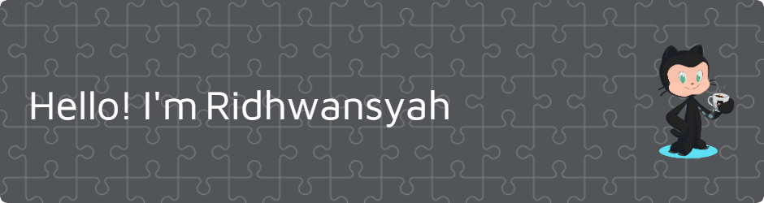

I'm an Information Systems student at Universitas Gunadarma, currently diving into the world of Web Development. Currently focused on learning modern tools like the **Laravel framework**. Passionate about building responsive and meaningful websites that solve real-world problems.  

##### You can contact me:

<!--
**ridhwansyah/ridhwansyah** is a ✨ _special_ ✨ repository because its `README.md` (this file) appears on your GitHub profile.

Here are some ideas to get you started:

- 🔭 I’m currently working on ...
- 🌱 I’m currently learning ...
- 👯 I’m looking to collaborate on ...
- 🤔 I’m looking for help with ...
- 💬 Ask me about ...
- 📫 How to reach me: ...
- 😄 Pronouns: ...
- ⚡ Fun fact: ...
-->
